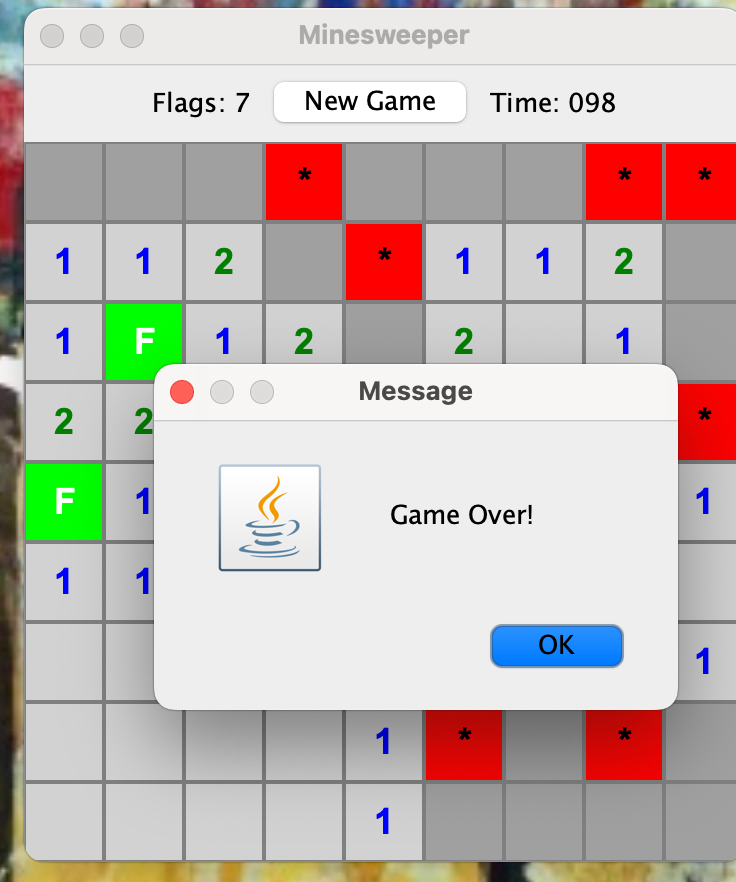
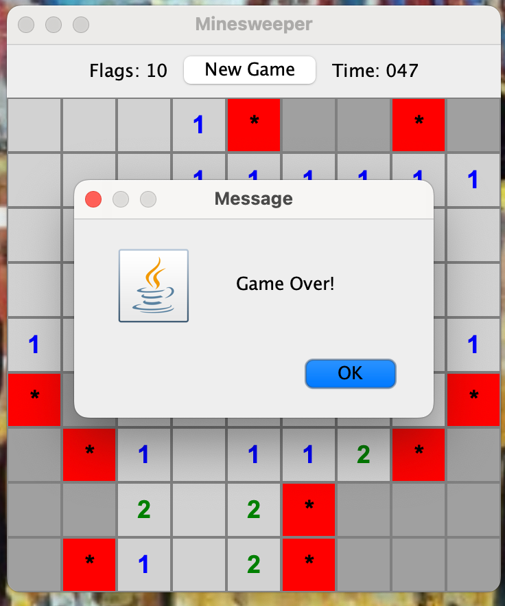

### MineSweeper

MineSweeper is a classic puzzle game where players uncover squares on a grid while avoiding hidden mines. The objective is to clear the board without detonating any mines, using numerical clues to deduce their locations.

### Screenshots

#### Links

- [Github](https://github.com/sbleier/bleier-minesweeper)
